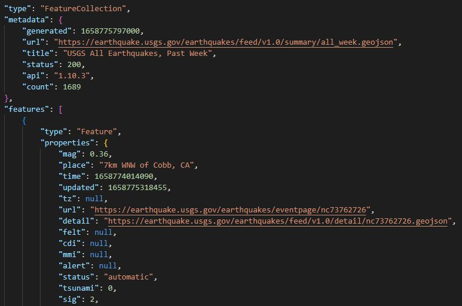
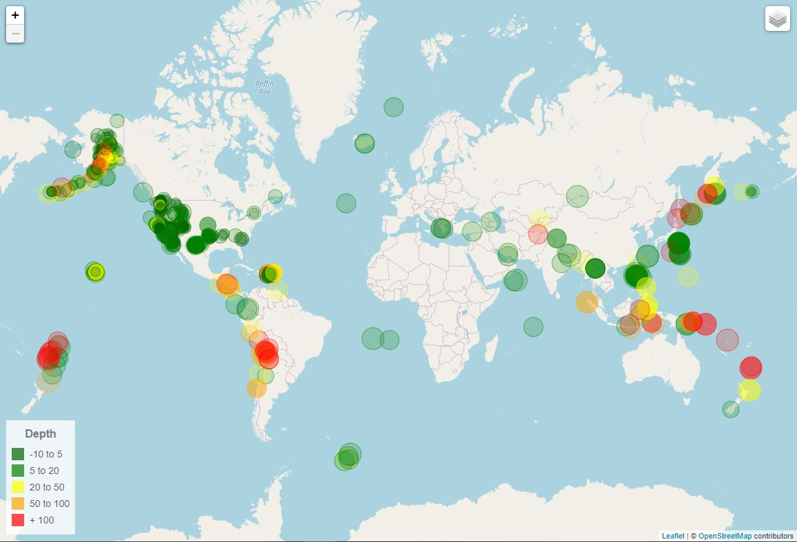
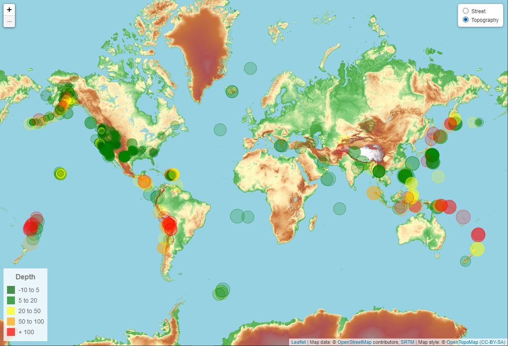

# leaflet-challenge
## Visualizing geo-data with Leaflet

The United States Geological Survey, or USGS for short, is responsible for providing scientific data about natural hazards, the health of our ecosystems and environment, and the impacts of climate and land-use change. 

The USGS also provides earthquake data in a number of different formats, updated every five minutes.

I have chosen to visualise the dataset with the earthquakes of the last 7 days, in GeoJSON format.
[USGS GeoJSON Documentation.](http://earthquake.usgs.gov/earthquakes/feed/v1.0/geojson.php).

### Earthquake Visualisation

I have imported and visualised the data: 

   * Using Leaflet, I have created a map that plots all the earthquakes from the dataset based on their longitude and latitude.

       *  Data markers reflect the magnitude of the earthquake by their size and the depth of the earthquake by color. Earthquakes with higher magnitudes appear larger, and earthquakes with greater depth appear darker in color.

   * I have included popups that provide additional information about the earthquake when its associated marker is clicked.

   * I have created a legend that provides context for the map data.

